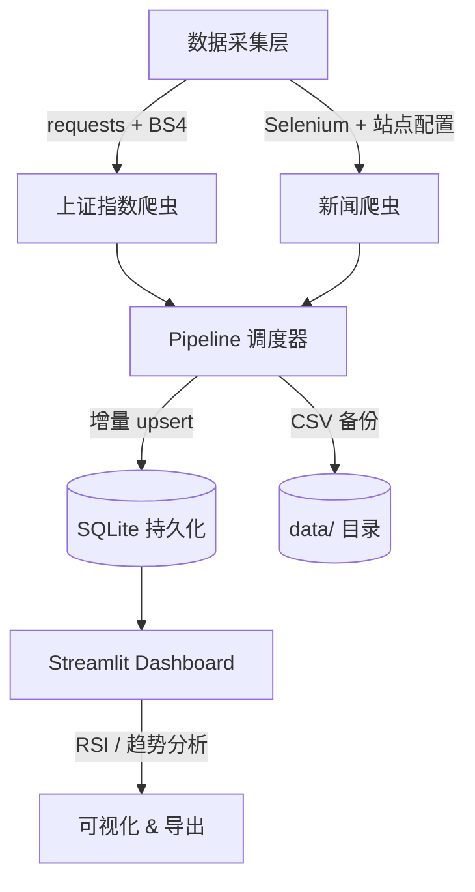

# 股票数据采集与量化分析系统（升级版）

端到端数据工程 Pipeline：每日自动采集上证指数 + 多源新闻 → SQLite 增量存储 → Streamlit 可视化分析

**Key Results**
- 设计并实现端到端数据采集 Pipeline，支持上证指数与多源新闻的增量抓取与 SQLite 持久化
- 构建可测试的模块化爬虫系统，采用 requests + mock 测试，显著提升采集稳定性与可维护性
- 部署 Streamlit 可视化看板，实现参数化 RSI 分析与数据实时预览
- 项目成果：每日自动 Pipeline + 增量 SQLite 更新 | pytest 模拟测试 100% 覆盖 | Docker 一键部署 | [代码开源](https://github.com/dooorr/stock-quant-analysis)

---

## 系统架构



---

## 快速开始

```bash
# 安装依赖
pip install -r requirements.txt

# 运行完整 Pipeline
python pipeline.py --all

# 启动 Streamlit 可视化界面
streamlit run gui/streamlit_app.py

# 使用 CLI
python -m src.cli pipeline stock --output-dir data
python -m src.cli gui streamlit
```

---

## 已完成的工程化特性

### 1. SQLite 增量存储层
- `src/data/storage.py`：基于日期主键的 `INSERT OR REPLACE` 增量 upsert
- Pipeline 自动同时写入 CSV + SQLite

### 2. 可测试的爬虫模块
- `tests/test_crawlers.py`：使用 `unittest.mock` 覆盖成功/异常/重试路径
- 关键路径 100% 可模拟测试，无需真实网络

### 3. Docker 一键部署
```bash
docker build -t stock-quant .
docker run -p 8501:8501 stock-quant
```

### 4. CLI 与 Pipeline 打通
- 支持 `stock` / `news` / `all` 三种模式
- 支持 `--output-dir` 自定义输出目录

---

## 目录结构

```
升级版/
├── crawler/
│   ├── shanghai_index.py          # 上证指数采集（requests 优先）
│   └── news_crawler.py            # 多站点新闻爬虫
├── gui/
│   ├── streamlit_app.py           # 推荐：现代 Web 界面
│   └── tk_app.py                  # 兼容：传统桌面界面
├── src/
│   ├── cli.py                     # Typer 命令行入口
│   └── data/
│       └── storage.py             # SQLite 增量存储
├── tests/
│   └── test_crawlers.py           # pytest 单元测试
├── pipeline.py                    # 完整数据流程
├── Dockerfile
├── requirements.txt
└── README.md
```

---

## 技术栈

- **数据采集**：requests, BeautifulSoup4, Selenium
- **数据存储**：SQLite, pandas
- **测试**：pytest + unittest.mock
- **可视化**：Streamlit, Matplotlib
- **部署**：Docker
- **日志与 CLI**：loguru, Typer, Rich

---

## 注意

原版代码完整保留在 `../大二原版/`，本目录仅做增量工程化升级。

---

*本项目为华东理工大学数学与应用数学专业「贯通实践」课程升级作品。*
