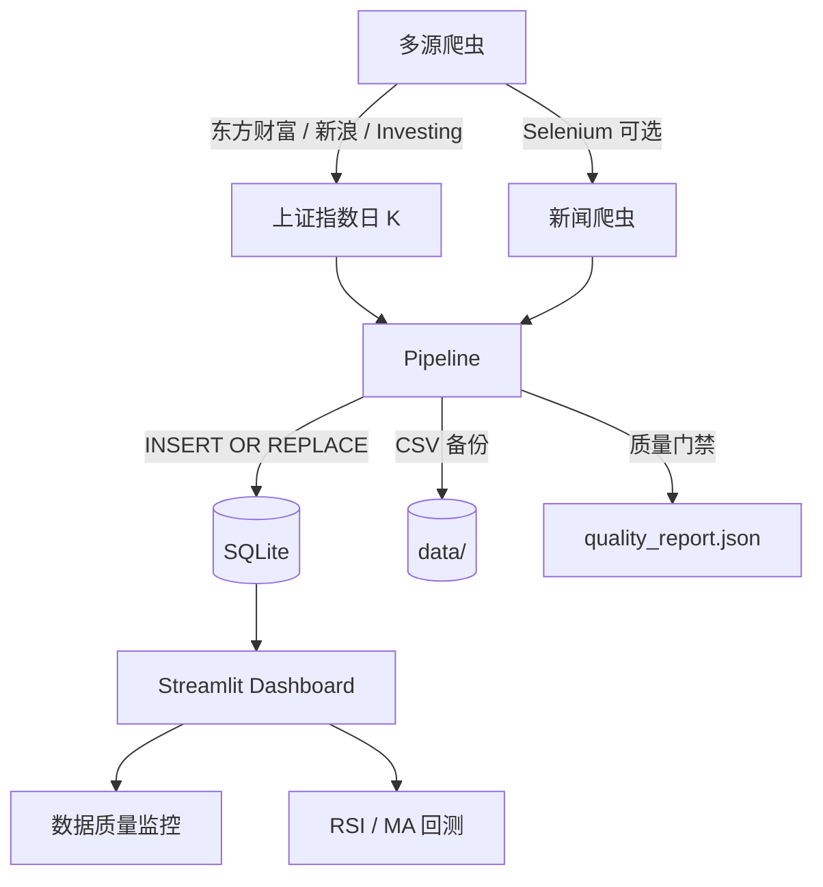

# 股票数据采集与量化分析系统

[](https://github.com/dooorr/stock-quant-analysis)

端到端数据工程 Pipeline：多源采集上证指数日 K → SQLite 增量存储 → 数据质量门禁 → Streamlit 量化看板（RSI / MA 回测）

**Key Results**
- 多源行情爬虫（东方财富 / 新浪 / Investing 自动回退），单次可拉 **1000+ 条**日 K，替代原仅 ~20 条的页面抓取
- Pipeline 入库后自动输出**数据质量报告**（空值、缺口、异常跳变、OHLC 一致性）至日志与 `quality_report.json`
- 基于 `BaseStrategy` 实现 **RSI + MA 金叉死叉**策略回测，Streamlit 对比买入持有基准收益
- **GitHub Actions 每日 cron** + pytest 全覆盖 + Docker 部署 | [代码开源](https://github.com/dooorr/stock-quant-analysis)

---

## 系统架构



---

## 快速开始

```bash
# 安装依赖
pip install -r requirements.txt

# 采集行情（新浪源国内较稳，单次最多约 1023 条）
py pipeline.py --stock-only --history-limit 1023

# 启动 Streamlit 看板
py -m streamlit run gui/streamlit_app.py
# 或（PATH 已配置时）streamlit run gui/streamlit_app.py

# CLI
py -m src.cli fetch stock --history-limit 500
py -m src.cli pipeline stock --history-limit 1023
py -m src.cli gui streamlit
```

> **说明**：默认 `auto` 模式会先尝试东方财富（最多约 10000 条），失败则自动切新浪。若网络下东方财富 SSL 报错，属正常现象，新浪回退会自动生效。

---

## 已完成的工程化特性

### 1. SQLite 增量存储层
- `src/data/storage.py`：日期主键 `INSERT OR REPLACE` 增量 upsert
- Pipeline 同时写入 `data/stock_data.csv` 与 `data/stock_data.db`

### 2. 多源历史行情爬虫
- 统一入口 `fetch_shanghai_index(lmt=..., source="auto")`
- **东方财富 JSON API**（最多约 10000 条）→ **新浪财经 API**（最多约 1023 条）→ **Investing AJAX** → 首页兜底
- `--history-limit N` 控制目标条数；`source=sina` 可跳过东方财富直接走新浪

### 3. 数据质量监控
- `src/analysis/data_quality.py`：空值率、重复日期、工作日缺口、价格跳变（阈值 + 3σ）、OHLC 一致性、健康评分
- Pipeline 入库后自动 `loguru` 摘要 + 写入 `data/quality_report.json`
- Streamlit「数据质量监控」标签页可视化

### 4. 可扩展策略回测框架
- `BaseStrategy` + T+1 通用回测引擎（`backtest_base.py`）
- RSI 超买超卖（`rsi_backtest.py`）、MA 金叉死叉（`ma_backtest.py`）
- Streamlit 参数调节 + 策略 vs 买入持有收益曲线

### 5. 测试与 CI/CD
- pytest：`test_crawlers` / `test_data_quality` / `test_pipeline_quality` / `test_rsi_backtest` / `test_ma_backtest`
- GitHub Actions 每日 UTC 16:00 执行 `pipeline.py --stock-only --history-limit 800`
- `scripts/daily_run.py` 供本地定时任务

### 6. 部署与 CLI
- Docker：`docker build -t stock-quant . && docker run -p 8501:8501 stock-quant`
- Typer CLI：`src/cli.py` 支持 fetch / pipeline / gui

---

## 目录结构

```
├── .github/workflows/daily-stock-pipeline.yml
├── crawler/
│   ├── shanghai_index.py          # 多源日 K 爬虫
│   └── news_crawler.py
├── gui/
│   ├── streamlit_app.py           # 质量监控 + 量化分析
│   └── tk_app.py
├── scripts/daily_run.py
├── src/
│   ├── analysis/                  # 质量检测 + 回测策略
│   ├── cli.py
│   └── data/storage.py
├── tests/
├── pipeline.py
├── Dockerfile
├── requirements.txt
└── README.md
```

---

## 技术栈

- **数据采集**：requests, BeautifulSoup4, Selenium（新闻可选）
- **存储与分析**：SQLite, pandas, numpy
- **可视化**：Streamlit, Matplotlib
- **工程**：loguru, Typer, pytest, Docker, GitHub Actions

---

## 免责声明

本项目仅供课程学习与个人研究，数据来源于公开行情接口，**不构成任何投资建议**。请遵守各数据源服务条款，低频、自用、勿商用爬取。
