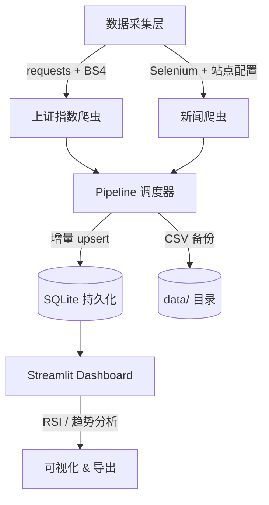

# 股票数据采集与量化分析系统

端到端数据工程 Pipeline：每日自动采集上证指数 + 多源新闻 → SQLite 增量存储 → Streamlit 可视化分析

**Key Results**
- 设计并实现端到端数据采集 Pipeline，支持上证指数与多源新闻的增量抓取与 SQLite 持久化
- 构建可测试的模块化爬虫系统，采用 requests + mock 测试，显著提升采集稳定性与可维护性
- 部署 Streamlit 可视化看板，实现参数化 RSI 分析与 **RSI 超买超卖策略回测**（对比买入持有基准收益）
- 项目成果：**每日自动 Pipeline（GitHub Actions cron）** + 增量 SQLite 更新 | pytest 模拟测试 100% 覆盖 | Docker 一键部署 | [代码开源](https://github.com/dooorr/stock-quant-analysis)

---

## 系统架构



---

## 快速开始

```bash
# 安装依赖
pip install -r requirements.txt

# 运行完整 Pipeline（默认拉取约 3000 条日 K）
python pipeline.py --stock-only
python pipeline.py --stock-only --history-limit 5000   # 最多约 10000

# 启动 Streamlit 可视化界面
streamlit run gui/streamlit_app.py

# 使用 CLI
python -m src.cli pipeline stock --output-dir data
python -m src.cli gui streamlit
```

---

## 已完成的工程化特性

### 1. SQLite 增量存储层
- `src/data/storage.py`：基于日期主键的 `INSERT OR REPLACE` 增量 upsert
- Pipeline 自动同时写入 CSV + SQLite

### 2. 多源历史行情爬虫
- `crawler/shanghai_index.py` 统一入口 `fetch_shanghai_index(lmt=3000)`
- **优先东方财富 JSON API**（最多约 10000 条）
- 失败时回退 **新浪财经 API**（最多约 1023 条，国内网络通常更稳）
- 再失败则用 **Investing.com AJAX 分页**，最后兜底首页 ~20 条
- Pipeline / CLI 支持 `--history-limit N` 控制拉取条数

### 3. 可测试的爬虫模块
- `tests/test_crawlers.py`：使用 `unittest.mock` 覆盖成功/异常/重试路径
- 关键路径 100% 可模拟测试，无需真实网络

### 4. Docker 一键部署
```bash
docker build -t stock-quant .
docker run -p 8501:8501 stock-quant
```

### 5. CLI 与 Pipeline 打通
- 支持 `stock` / `news` / `all` 三种模式
- 支持 `--output-dir` 自定义输出目录

### 6. 数据质量监控
- `src/analysis/data_quality.py`：空值率、重复日期、工作日缺口、价格异常跳变（阈值 + 3σ）、OHLC 一致性
- **Pipeline 集成**：`pipeline.py` 在 SQLite 入库后自动跑质量检测，loguru 输出摘要日志，并写入 `data/quality_report.json`
- Streamlit 看板「数据质量监控」标签页：健康评分、问题清单与明细表
- `tests/test_data_quality.py`、`tests/test_pipeline_quality.py` 单元测试覆盖

### 7. 可扩展策略回测框架
- `src/analysis/backtest_base.py`：`BaseStrategy` 抽象 + 通用 T+1 回测引擎
- `src/analysis/rsi_backtest.py`：RSI 超买超卖（< 30 建仓、> 70 平仓）
- `src/analysis/ma_backtest.py`：双均线金叉死叉（短期 MA > 长期 MA 持仓）
- Streamlit 看板同时展示 RSI / MA 收益曲线与基准对比
- `tests/test_rsi_backtest.py`、`tests/test_ma_backtest.py` 单元测试覆盖

### 8. 每日自动定时任务（CI/CD）
- **GitHub Actions**：`.github/workflows/daily-stock-pipeline.yml` 每天 UTC 16:00（北京时间 00:00）自动执行 `pipeline.py --stock-only`
- **本地入口**：`scripts/daily_run.py` 便于 Windows 任务计划程序 / Linux cron 调用
- 采集结果自动上传为 GitHub Artifact（保留 30 天）
- 真正实现「每日自动采集上证指数」并持久化到 SQLite

---

## 目录结构

```
├── .github/workflows/
│   └── daily-stock-pipeline.yml   # GitHub Actions 每日定时任务
├── crawler/
│   ├── shanghai_index.py          # 上证指数采集（requests 优先）
│   └── news_crawler.py            # 多站点新闻爬虫
├── gui/
│   ├── streamlit_app.py           # 推荐：现代 Web 界面
│   └── tk_app.py                  # 兼容：传统桌面界面
├── scripts/
│   └── daily_run.py               # 本地每日任务入口（支持 cron / 任务计划程序）
├── src/
│   ├── analysis/
│   │   ├── backtest_base.py       # BaseStrategy + 回测引擎
│   │   ├── data_quality.py        # 数据质量检测
│   │   ├── ma_backtest.py         # MA 金叉死叉策略
│   │   └── rsi_backtest.py        # RSI 策略回测
│   ├── cli.py                     # Typer 命令行入口
│   └── data/
│       └── storage.py             # SQLite 增量存储
├── tests/
│   ├── test_crawlers.py           # 爬虫 pytest
│   ├── test_data_quality.py       # 数据质量 pytest
│   ├── test_ma_backtest.py        # MA 回测 pytest
│   └── test_rsi_backtest.py       # RSI 回测 pytest
├── pipeline.py                    # 完整数据流程
├── Dockerfile
├── requirements.txt
└── README.md
```

---

## 技术栈

- **数据采集**：requests, BeautifulSoup4, Selenium
- **数据存储**：SQLite, pandas
- **测试**：pytest + unittest.mock
- **可视化**：Streamlit, Matplotlib
- **部署**：Docker
- **日志与 CLI**：loguru, Typer, Rich

